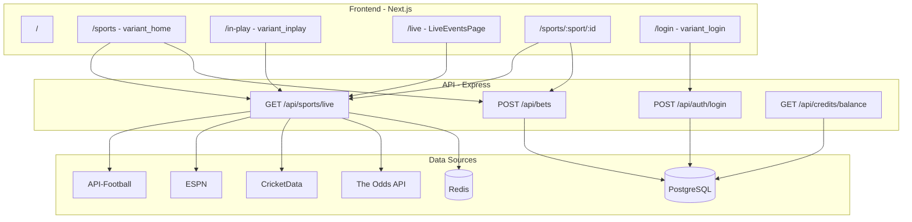

# BetArena Application Documentation

Comprehensive documentation of the BetArena sports betting platform: architecture, features, APIs, infrastructure, gaps, component analysis, user flows, and UX inconsistencies.

---

## 1. Application Overview

### Tech Stack

- **Frontend**: Next.js 14 (App Router), React, TypeScript, Zustand, React Query, Tailwind CSS
- **Backend**: Express.js, TypeScript, Knex.js
- **Data**: PostgreSQL 15, Redis 7
- **Real-time**: Socket.io
- **Build**: Monorepo with npm workspaces

### Monorepo Structure

```
betarena/
├── apps/
│   ├── web/          # Next.js frontend
│   └── api/          # Express API
├── packages/         # Shared packages (if any)
├── variant-exports/  # 13 JS variant components
├── docker-compose.yml
└── package.json      # Workspace root
```

### Two UI Systems in Parallel

1. **Variant exports** ([`variant-exports/`](../variant-exports/)): 13 JSX files using React Router shims (`Link`, `useNavigate`, `useLocation`) that are imported into Next.js pages. These provide the primary sports-betting UI (home, in-play, results, login, match pages).
2. **Next.js-native components**: TypeScript components in [`apps/web/src/components/`](../apps/web/src/components/) and inline in pages. Used for LiveEventsPage, LiveMatchCard, AuthGuard, MemberGlobalChrome, and sport-specific match pages.

---

## 2. Current Features (Implemented)

| Feature | Route | Implementation | Status |
|---------|-------|----------------|--------|
| Login | `/login` | [apps/web/src/app/(auth)/login/page.tsx](../apps/web/src/app/(auth)/login/page.tsx) via [variant_login.js](../variant-exports/variant_login.js) | Implemented |
| Sports lobby with live odds | `/sports` | [apps/web/src/app/(member)/sports/page.tsx](../apps/web/src/app/(member)/sports/page.tsx) via [variant_home.js](../variant-exports/variant_home.js) | Implemented |
| In-Play (variant) | `/in-play` | [apps/web/src/app/(member)/in-play/page.tsx](../apps/web/src/app/(member)/in-play/page.tsx) via [variant_inplay.js](../variant-exports/variant_inplay.js) | Implemented |
| Live events grid | `/live` | [apps/web/src/app/(member)/live/page.tsx](../apps/web/src/app/(member)/live/page.tsx) via [LiveEventsPage.tsx](../apps/web/src/components/live/LiveEventsPage.tsx) | Implemented |
| Sport-specific pages | `/sports/football`, `/sports/basketball`, etc. | [apps/web/src/app/(member)/sports/](../apps/web/src/app/(member)/sports/) | Implemented |
| Match detail pages | `/sports/{sport}/{eventId}` | Football, Basketball, Tennis, Cricket, Golf, Esports, Horse Racing | Implemented |
| Results | `/results` | [apps/web/src/app/(member)/results/page.tsx](../apps/web/src/app/(member)/results/page.tsx) via [variant_results.js](../variant-exports/variant_results.js) | Implemented |
| My Bets | `/my-bets` | [apps/web/src/app/(member)/my-bets/page.tsx](../apps/web/src/app/(member)/my-bets/page.tsx) via [variant_my_bets.js](../variant-exports/variant_my_bets.js) | Auth required |
| Account | `/account`, `/account/settings`, `/account/transactions` | [apps/web/src/app/(member)/account/](../apps/web/src/app/(member)/account/) via [variant_my_account.js](../variant-exports/variant_my_account.js) | Auth required |
| Admin dashboard | `/admin/dashboard`, `/admin/agents`, etc. | [apps/web/src/app/(admin)/](../apps/web/src/app/(admin)/) via [variant_admin_dashboard.js](../variant-exports/variant_admin_dashboard.js) | Role: admin |
| Agent dashboard | `/agent/dashboard`, `/agent/members`, etc. | [apps/web/src/app/(agent)/](../apps/web/src/app/(agent)/) via [variant_agent_dashboard.js](../variant-exports/variant_agent_dashboard.js) | Role: agent/sub_agent |
| Bet slip (global) | N/A (chrome) | [MemberGlobalChrome.tsx](../apps/web/src/components/app/MemberGlobalChrome.tsx) + [betSlipStore.ts](../apps/web/src/stores/betSlipStore.ts) | Implemented |
| Balance display | Header | `useBalance` hook, [CreditsContext](../apps/web/src/contexts/CreditsContext.tsx) | Implemented |
| Place bet | N/A | POST `/api/bets` from MemberGlobalChrome | Implemented |

---

## 3. API Integrations

### 3.1 Sports Data APIs (6 Providers)

| Provider | Config Key | Purpose | Free Tier | Implementation |
|---------|------------|---------|-----------|----------------|
| API-Football | `APISPORTS_KEY` | Live football fixtures | 100 req/day | [apps/api/src/modules/sports-data/providers/api-football.ts](../apps/api/src/modules/sports-data/providers/api-football.ts) |
| ESPN (hidden) | None | US scoreboards (NBA, NFL, NHL, MLB, EPL, UCL) | Free | [apps/api/src/modules/sports-data/providers/espn-hidden.ts](../apps/api/src/modules/sports-data/providers/espn-hidden.ts) |
| TheSportsDB | Hardcoded `123` | Team/league info | Free | [apps/api/src/modules/sports-data/providers/thesportsdb.ts](../apps/api/src/modules/sports-data/providers/thesportsdb.ts) |
| CricketData / CricAPI | `CRICKET_API_KEY` | Live cricket scores | 100 req/day | [apps/api/src/modules/sports-data/providers/cricket-data.ts](../apps/api/src/modules/sports-data/providers/cricket-data.ts) |
| OddsPapi | `ODDSPAPI_KEY` | Pre-match/live odds | 250 req/month | [apps/api/src/modules/sports-data/providers/oddspapi.ts](../apps/api/src/modules/sports-data/providers/oddspapi.ts) |
| The Odds API | `ODDS_API_KEY` | Bulk upcoming odds, enrichment | 500 credits/month | [apps/api/src/modules/sports-data/providers/the-odds-api.ts](../apps/api/src/modules/sports-data/providers/the-odds-api.ts) |

**Live endpoint**: `GET /api/sports/live` aggregates API-Football, ESPN, CricketData and enriches events with The Odds API bulk odds (team-name matching). Implemented in [sports-data.service.ts](../apps/api/src/modules/sports-data/sports-data.service.ts).

### 3.2 Backend API Routes

All routes are mounted under `/api` except auth which is under `/api/auth`.

#### Auth ([auth.routes.ts](../apps/api/src/modules/auth/auth.routes.ts))

- `POST /api/auth/login` - Login with username/password, sets cookies
- `POST /api/auth/logout` - Logout, clears cookies
- `POST /api/auth/refresh` - Refresh access token
- `GET /api/auth/me` - Current user (requires auth)
- `PATCH /api/auth/preferences` - Update user preferences
- `POST /api/auth/change-password` - Change password (requires auth)

#### Bets ([bets.routes.ts](../apps/api/src/modules/bets/bets.routes.ts))

- `POST /api/bets` - Place bet (member role)
- `GET /api/bets/my-bets` - User's bets
- `POST /api/bets/:betUid/cashout` - Cash out
- `POST /api/bets/:betUid/cashout/partial` - Partial cash out

#### Credits ([credits.routes.ts](../apps/api/src/modules/credits/credits.routes.ts))

- `GET /api/credits/balance` - User balance
- `GET /api/credits/transactions` - Transaction history
- `POST /api/credits/transfer` - Transfer credits (admin/agent)
- `POST /api/credits/admin/create` - Create credits (admin)
- `GET /api/credits/admin/overview` - Credits overview (admin)

#### Sports ([sports.routes.ts](../apps/api/src/modules/sports/sports.routes.ts))

- `GET /api/sports` - List sports
- `GET /api/sports/live` - Live events
- `GET /api/sports/:sport/events` - Events by sport
- `GET /api/sports/:sport/competitions/:id/events` - Events by competition
- `GET /api/sports/events/:id/markets` - Markets for an event

#### Results ([results.routes.ts](../apps/api/src/modules/results/results.routes.ts))

- `GET /api/results` - Settled results

#### Admin, Agents, Logs, Gaming

- Admin: agents, members, credits/create, credits/ledger
- Agents: members, sub-agents, member bets, member credits
- Logs: `GET /api/admin/logs`
- Gaming: lobby, promotions, racecards, virtual-sports

---

## 4. Containers and Infrastructure

From [docker-compose.yml](../docker-compose.yml):

| Service | Image | Port (dev) | Purpose |
|---------|-------|------------|---------|
| postgres | postgres:15-alpine | 5433 (host) → 5432 (container) | PostgreSQL database |
| redis | redis:7-alpine | 6380 (host) → 6379 (container) | Redis cache |
| api | Custom (apps/api/Dockerfile) | 4000 | Express API |
| web | Custom (apps/web/Dockerfile) | 3000 | Next.js frontend |

**Local dev** (typical): `npm run dev` runs API and web concurrently. Postgres and Redis run via `docker compose up -d`. API reads from `apps/api/.env`; DB_HOST=127.0.0.1, REDIS_HOST=127.0.0.1 when not using Docker for the app.

**Environment variables**: See [.env.example](../.env.example) for full list. Key vars: `APISPORTS_KEY`, `CRICKET_API_KEY`, `ODDSPAPI_KEY`, `ODDS_API_KEY`, `JWT_SECRET`, `CORS_ORIGIN`.

---

## 5. Database Schema

From [migrations](../apps/api/migrations/):

- **users**: id, display_id, username, password_hash, role (admin/agent/sub_agent/member), nickname, is_active, created_by, parent_agent_id, can_create_sub_agent
- **credit_accounts**: user_id, balance, total_received, total_sent
- **credit_transactions**: from_user_id, to_user_id, amount, type (create/transfer/deduct)
- **bets**: user_id, event_id, selections, stake, odds, status, etc.
- **events**: sport, home_team, away_team, league, status, starts_at, score
- **odds**: event_id, market_type, selections (JSON)
- **system_logs**: audit trail

---

## 6. Missing or Incomplete Features

| Gap | Current State | Notes |
|-----|---------------|-------|
| **Sign up / Register** | Not implemented | No public registration endpoint. Users created by admin/agent. Intentional per [AI_Rules.md](../AI_Rules.md). |
| **Forgot password** | UI-only | "Forgot?" link in LoginCard; [variant_login.js](../variant-exports/variant_login.js) line ~392 shows `alert('Contact your agent to reset your password.')`. No reset endpoint, no email flow. |
| **Forgot password page** | None | Link uses `href="#"`; no dedicated route. |
| **Contact your agent** | UI-only | "Contact your agent" span in login; no href, no action. |
| **Score Updates panel** | Hardcoded | [ScoreUpdatesPanel](../variant-exports/variant_inplay.js) in variant_inplay.js shows static Arsenal–Chelsea, Man City–Liverpool, Real Madrid–Atletico, Djokovic–Alcaraz, Lakers–Warriors, PSG–Bayern. Not wired to live data. |
| **Duplicate In-Play / Live** | Two implementations | `/in-play` (variant_inplay.js) vs `/live` (LiveEventsPage.tsx). Both show live events; different layouts, filters, and components. |
| **Odds unavailable** | Some events | [LiveMatchCard.tsx](../apps/web/src/components/live/LiveMatchCard.tsx) shows "Odds unavailable" when event has no markets. |
| **BetSlipPick compatibility** | Addressed | BetSlipPick includes eventId, marketType for API. [plans/2026-02-28-production-readiness.md](plans/2026-02-28-production-readiness.md) documents the enrichment. |

---

## 7. Component Analysis

From user-selected DOM paths and codebase search:

| Component | Location | Data Source | Notes |
|-----------|----------|-------------|-------|
| **LoginCard** | [variant_login.js](../variant-exports/variant_login.js), [variant_match_football.js](../variant-exports/variant_match_football.js) | Local form state | Username/password; Forgot? and Contact agent links. |
| **LiveCard** | [variant_home.js](../variant-exports/variant_home.js) | `liveApiEvents` from GET `/api/sports/live` | Renders league, teams, score, odds, markets count. |
| **InPlayPage** | [variant_inplay.js](../variant-exports/variant_inplay.js) | GET `/api/sports/live` every 15s | Filter pills, live cards, BetSlip, ScoreUpdatesPanel. |
| **ScoreUpdatesPanel** | [variant_inplay.js](../variant-exports/variant_inplay.js) | **Hardcoded** | Static scores (Arsenal, Man City, Real Madrid, Djokovic, Lakers, PSG). |
| **LiveEventsPage** | [LiveEventsPage.tsx](../apps/web/src/components/live/LiveEventsPage.tsx) | `useLiveEvents` (React Query) | Grid of LiveMatchCard, sport filter. |
| **LiveMatchCard** | [LiveMatchCard.tsx](../apps/web/src/components/live/LiveMatchCard.tsx) | Event prop | Sport, teams, score, odds or "Odds unavailable". |
| **AuthGuard** | [AuthGuard.tsx](../apps/web/src/components/AuthGuard.tsx) | `useAuthStore` | Redirects unauthenticated; role checks for admin/agent. |
| **ResultsPage** | [variant_results.js](../variant-exports/variant_results.js) | GET `/api/results` or mock | "SETTLED TODAY", "WINNING SETTLES", league match settlements. |
| **TennisMatchPage** | [sports/tennis/[eventId]/page.tsx](../apps/web/src/app/(member)/sports/tennis/[eventId]/page.tsx) | API + Socket | Match stats, markets, BetSlip, SportSidebar. |
| **BasketballMatchPage** | [sports/basketball/[eventId]/page.tsx](../apps/web/src/app/(member)/sports/basketball/[eventId]/page.tsx) | API + Socket | Q3, stats, markets. |
| **BetSlip** | Inline in sport pages + [MemberGlobalChrome.tsx](../apps/web/src/components/app/MemberGlobalChrome.tsx) | [betSlipStore.ts](../apps/web/src/stores/betSlipStore.ts) | Selections, stake, total odds, Place Bet. |
| **SportSidebar** | Inline in football, basketball, tennis, golf, esports pages | Static links | Sports, In-Play, Live Stream, My Bets, Results, Account. |
| **TopHeader** | Inline in sport match pages | `useBalance` | Balance ($0.00), nav links. |
| **MatchCard** | Various sport pages | Event data | Team names, score, odds buttons. |

---

## 8. User Flows and Use Cases

### 8.1 Guest (unauthenticated)

1. Land on `/` (home) or `/sports` (variant_home).
2. Browse live events, odds, match cards. Data from `/api/sports/live`.
3. Click odds → Add to bet slip (works; slip visible in MemberGlobalChrome).
4. Click "Place Bet" → Redirect to `/login?next=...` (triggerLoginForProtectedAction).
5. `/my-bets`, `/account` → AuthGuard shows "Log in to view your bets" with Sign In / Browse as guest.

### 8.2 Member (authenticated)

1. Login at `/login` → POST `/api/auth/login` → Redirect to `next` or `/sports`.
2. Balance shown in header via `useBalance` (GET `/api/credits/balance`).
3. Add selections to slip, set stake, Place Bet → POST `/api/bets`.
4. My Bets, Account, Transactions available.
5. Change password via Account settings (POST `/api/auth/change-password`).

### 8.3 Admin

1. Login → Redirect to `/admin/dashboard` (or `/overview`).
2. User management (agents, members), credits panel, logs, privileges, settings.
3. Create credits, transfer, manage agent status.

### 8.4 Agent

1. Login → Redirect to `/agent/dashboard`.
2. Members, sub-agents, reports, credits transfer.

---

## 9. UX Inconsistencies

| Issue | Description |
|-------|-------------|
| **Dual In-Play / Live** | `/in-play` (variant) vs `/live` (LiveEventsPage) duplicate purpose; different layouts, filters, and components. |
| **Variant vs Next.js styling** | Variants use inline styles and Tailwind; Next.js pages use Tailwind classes. Inconsistent spacing, typography, borders. |
| **SportSidebar duplication** | SportSidebar implemented inline in each sport page (football, basketball, tennis, golf, esports) with slight variations. |
| **BetSlip placement** | Global chrome (MemberGlobalChrome) vs inline BetSlip on sport pages; two interaction patterns. |
| **Balance $0.00** | Shown even when not logged in or when balance is zero; no distinction between "not loaded" and "zero". |
| **Forgot? / Contact agent** | Non-functional links; unclear CTAs. |
| **Score Updates static** | "Updated 2s ago" with hardcoded scores undermines trust. |
| **Odds display** | "—" vs "Odds unavailable" vs real odds; inconsistent messaging across LiveCard, LiveMatchCard, match pages. |
| **Navigation** | Some routes use sidebar, others use header; /sports vs /in-play vs /live not obviously ordered. |
| **Mobile** | [variant_mobile.js](../variant-exports/variant_mobile.js) exists; [mobile-preview](../apps/web/src/app/(member)/mobile-preview/page.tsx) route exists; unclear if fully wired. |

---

## 10. Data Flow Diagram



---

## 11. Variant Exports Inventory

| File | Purpose |
|------|---------|
| variant_home.js | Sports lobby, live cards, upcoming matches, bet slip |
| variant_inplay.js | In-Play page, filters, live events, ScoreUpdatesPanel |
| variant_login.js | Login form, LoginCard |
| variant_my_bets.js | My Bets page |
| variant_my_account.js | Account, settings, transactions |
| variant_results.js | Results page, settled markets |
| variant_admin_dashboard.js | Admin dashboard |
| variant_agent_dashboard.js | Agent dashboard |
| variant_agent_reports.js | Agent reports |
| variant_match_football.js | Football match view with LoginCard overlay |
| variant_cricket.js | Cricket match view |
| variant_horse_racing.js | Horse racing |
| variant_mobile.js | Mobile home, BetSlipModal |

---

## 12. Socket.io Events

- **Client → Server**: `join:event` (join event room), `leave:event`
- **Server → Client**: `live:update` (live score), `odds:update`, `event:update`
- **Scheduler**: Cron jobs in [cron-jobs.ts](../apps/api/src/modules/sports-data/scheduler/cron-jobs.ts) refresh live scores and odds for watched events, emitting to Socket rooms.

---

*Generated from the BetArena Application Documentation Plan. Last updated: 2026-03-01.*
